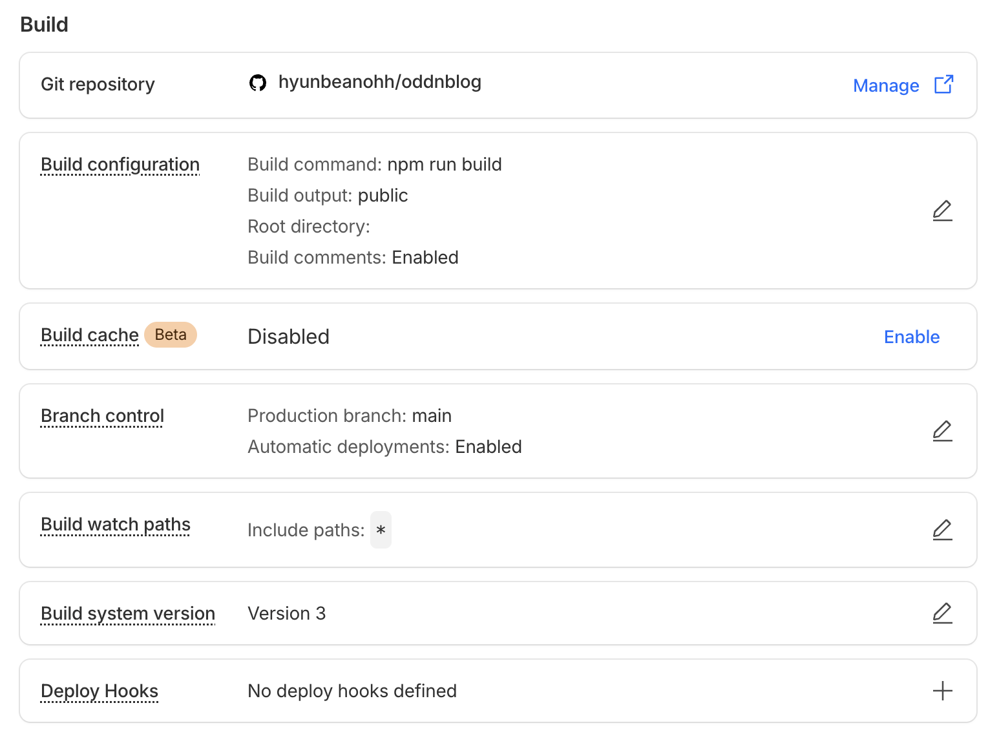
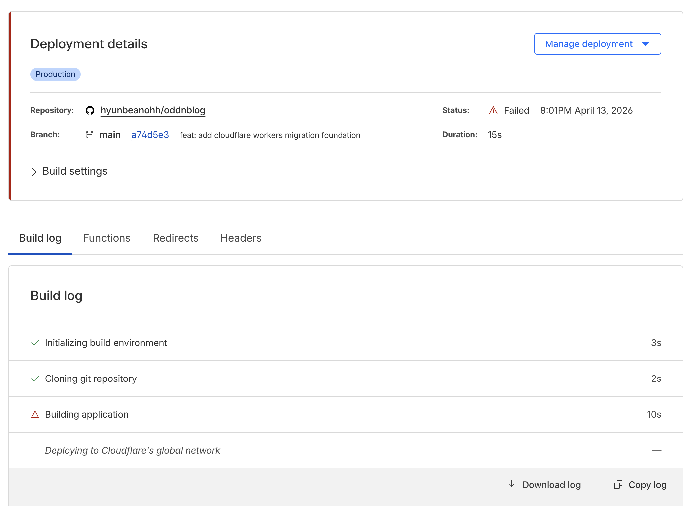
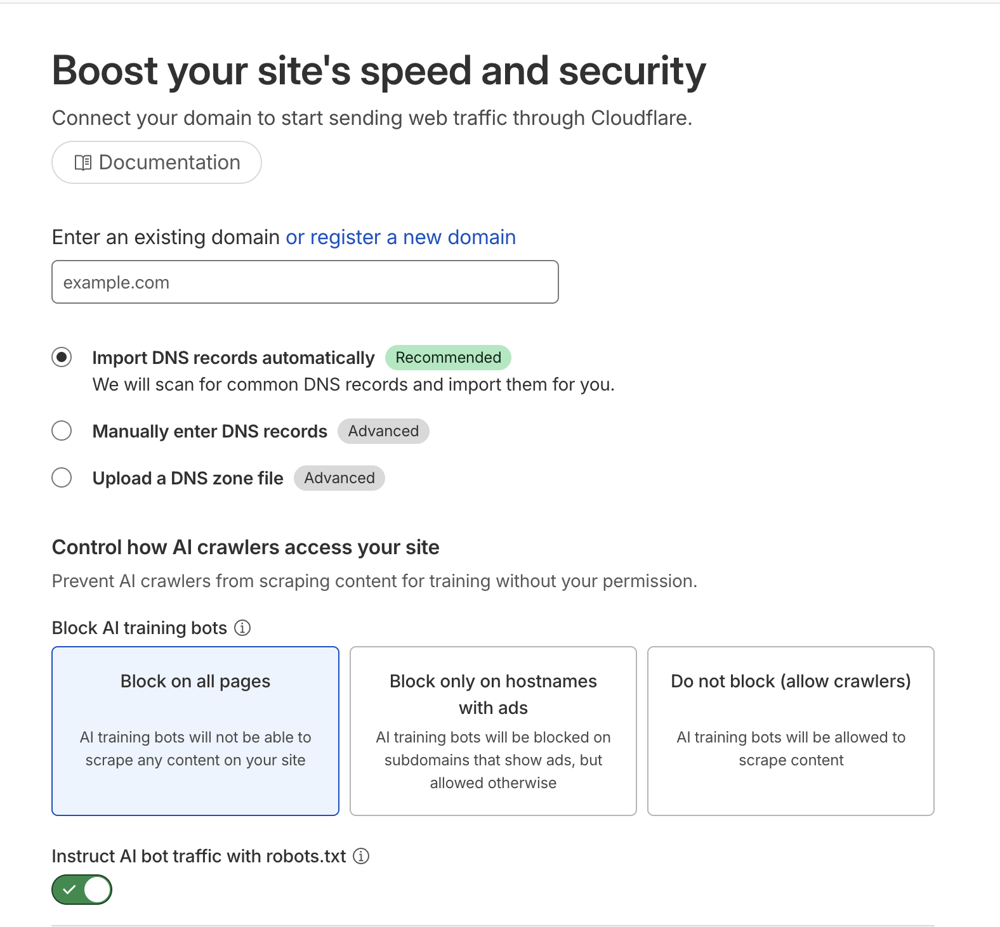
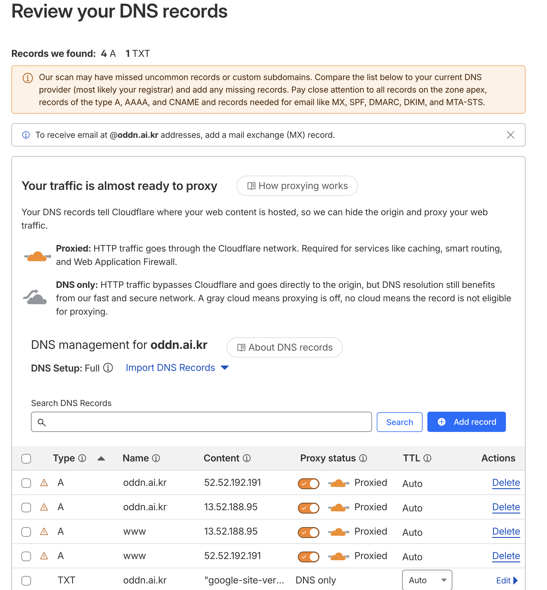
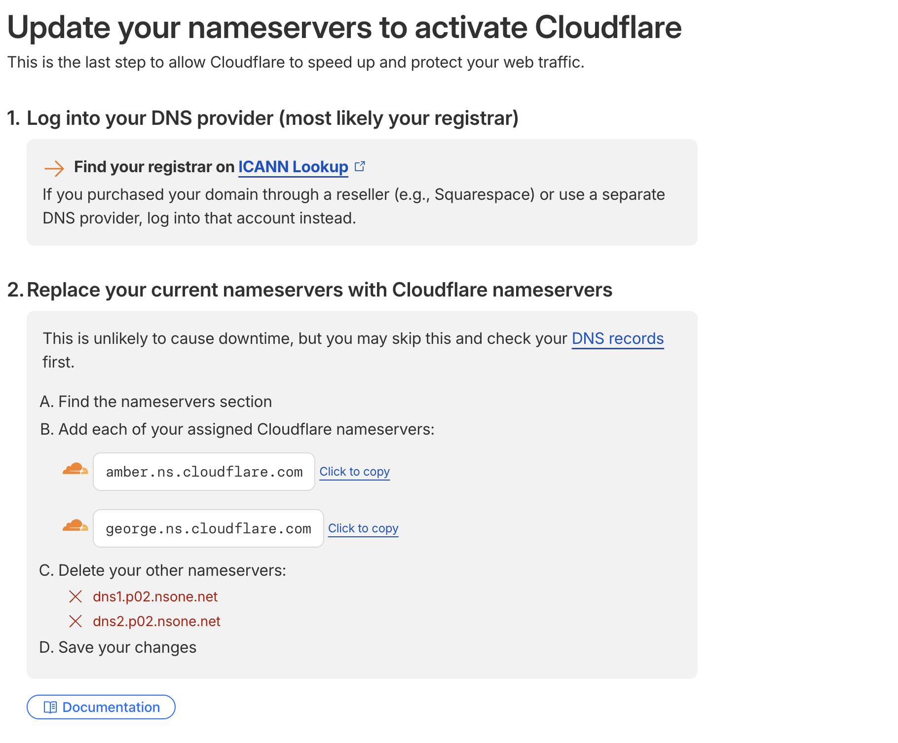
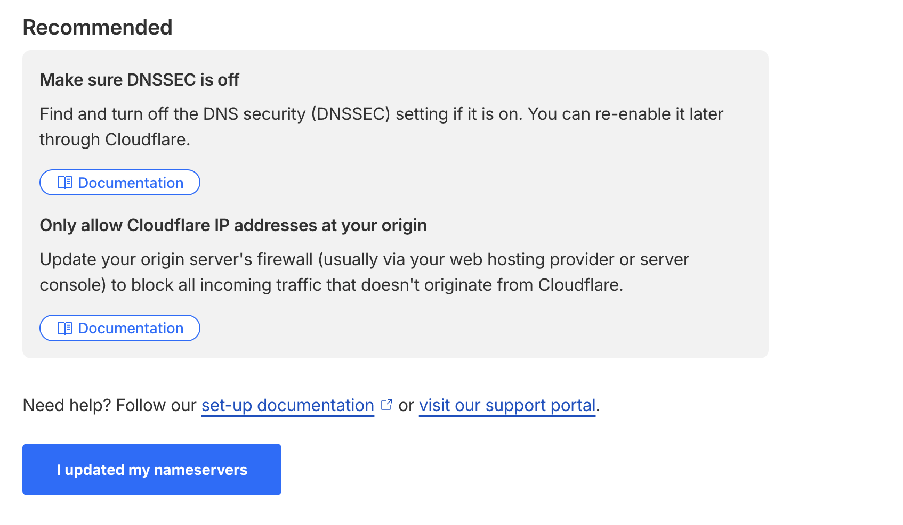
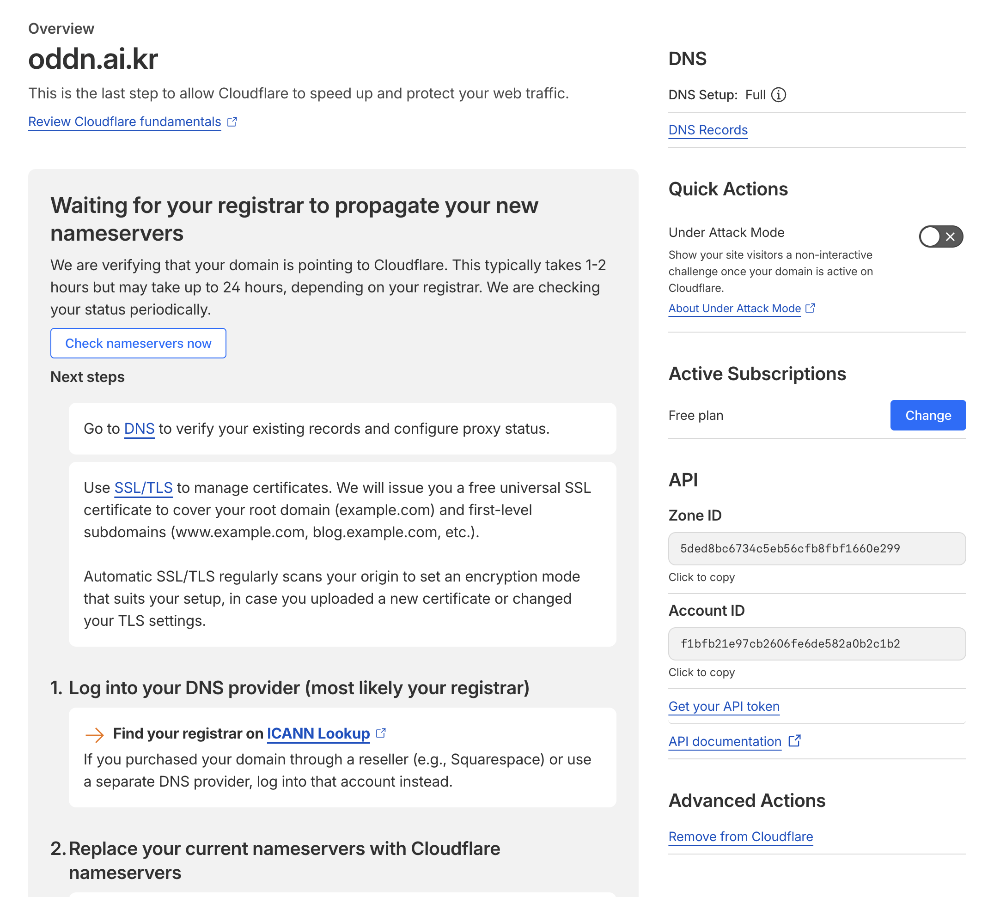
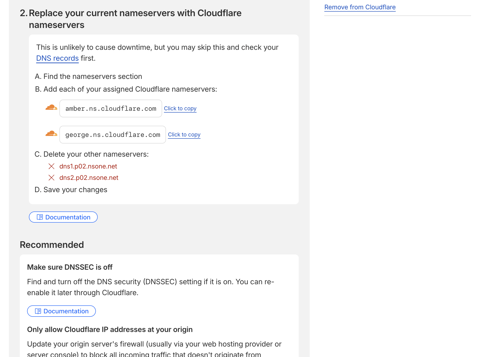
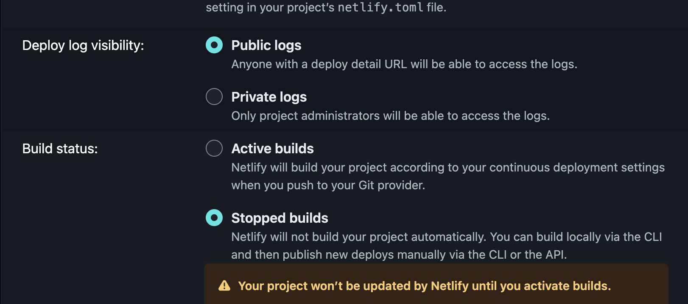
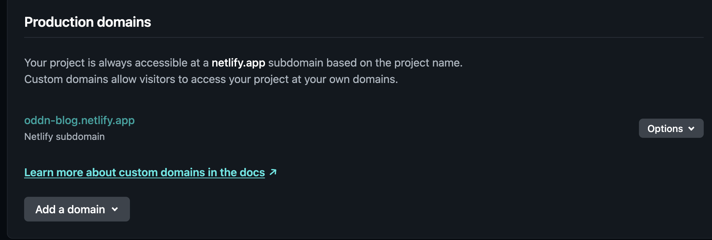

## 개요

최근 개인 블로그 배포 환경을 다시 정리해야겠다고 생각하게 됐다. 이유는 블로그를 직접 개발해서 수시로 푸시하면서 운영하고 있었는데, 기존 배포 환경에서는 월간 사용량이나 빌드 한도가 생각보다 빠르게 닳아 블로그 배포가 중단되는 것이 너무 불편했기 때문이다. 개인 프로젝트를 운영하는 입장에서는 글 하나 수정하거나, UI를 조금 손보고, 다시 배포하는게 빈번하게 일어나는데 이 과정이 너무 번거로워진 것도 한 몫을 했다.

그래서 이번에는 배포 환경을 Cloudflare 쪽으로 옮겨보기로 했다. 단순히 정적 페이지를 올리는 것만 생각한 것은 아니었다. 블로그를 직접 운영하는 김에 나중에는 Cloudflare Worker를 붙여서 댓글, 추천, 간단한 semantic search 같은 기능까지 도입해보고 싶었다. 즉, 이번 마이그레이션은 호스팅 이전이기도 했지만 앞으로 블로그를 어디까지 직접 제어할 수 있을지 실험하는 과정이기도 했다. 그리고 Cloudflare는 Netlify에서 제한하는 토큰 수가 없기 때문에 계속 배포되는 내 블로그 특성에 맞는 배포 환경이라고 생각이 됐다.

다만 실제로 마이그레이션을 진행해보니 "배포 플랫폼만 바꾸면 끝" 같은 문제는 아니었다. `npm ci`에서 lockfile 때문에 배포가 실패하기도 했고, Pages와 Workers의 경계도 생각보다 명확하게 구분해야 했으며, 마지막에는 DNS와 nameserver 전환까지 직접 만져야 했다. 

이번 글은 그 과정을 정리한 기록이다.

## 왜 Cloudflare였을까?

내가 기대했던 Cloudflare의 장점은 크게 두 가지였다.

1. 정적 페이지 배포 비용 구조가 비교적 가볍다.
2. Workers, D1, Vectorize 같은 기능이 바로 이어진다.

정적 블로그만 올린다면 대체재는 많다. 하지만 블로그를 운영하다 보면 단순히 HTML만 서빙하는 것으로 끝나지 않는다. 예를 들어 글에 추천 기능을 붙이고 싶을 수도 있고, 댓글을 자체적으로 운영해 보고 싶을 수도 있고, 나중에는 "이 블로그 안에서만 동작하는 검색"도 붙이고 싶어진다.

예전에는 이런 기능을 붙이려면 별도 백엔드나 외부 SaaS를 추가로 붙여야 한다고 생각했는데, 요즘은 Cloudflare 쪽 생태계가 꽤 많이 확장되어 있다고 GPT가 추천해줬다. 그래서 이번에는 정적 사이트는 Pages로 먼저 올리고, 그다음 Worker 기반 기능을 점진적으로 붙이는 쪽으로 방향을 잡았다.

## 처음 문제, 배포가 계속 실패했다

처음에는 단순히 GitHub 저장소를 Cloudflare Pages에 연결하고 빌드 커맨드를 `npm run build`로 지정하면 끝날 줄 알았다. 실제로 설정 화면만 보면 크게 이상한 부분도 없어 보였다.

- Build command: `npm run build`
- Build output: `public`
- Production branch: `main`



_Cloudflare Pages의 기본 빌드 설정 화면_

그런데 배포 로그를 보니 설치 단계에서 바로 실패하고 있었다.

```text
npm error `npm ci` can only install packages when your package.json and package-lock.json are in sync.
npm error Missing: yaml@2.8.3 from lock file
```



_최신 커밋 기준으로 다시 돌려도 설치 단계에서 lockfile 에러로 막혀버린다._

처음에는 "내 로컬에서는 잘 되는데 왜 Cloudflare에서만 안 되지?" 라는 생각이 들었다. 로컬에서는 `npm install`도 되고 `npm run build`도 통과하고 있었기 때문이다. 문제는 Cloudflare Pages가 `npm ci` 기반으로 의존성을 설치한다는 점이었다. 로컬의 느슨한 설치와 다르게, Pages는 lockfile이 정말로 정확하게 맞아야 한다.

조금 더 확인해 보니 `tailwindcss -> postcss-load-config` 쪽에서 `yaml`의 버전 요구사항과 현재 lockfile이 맞지 않는 상태였다. 결국 로컬에서 보이는 "대충 잘 되는 상태"와 CI에서 요구하는 "정확히 재현 가능한 상태"가 달랐던 것이다.

**배포 환경이 `npm ci`를 사용한다면 로컬에서도 같은 기준으로 검증해 보는 게 맞다.** 그냥 `npm install`이 되는지만 보면 안 된다.

## lockfile을 다시 맞추고 나서야 배포가 진행됐다

문제를 해결하는 과정 자체는 생각보다 길지 않았다.

핵심은 Cloudflare가 사용하던 npm 버전에 맞춰 lockfile을 다시 생성하는 것이었다.

```bash
npx npm@10.9.2 install --package-lock-only --ignore-scripts
npx npm@10.9.2 ci --ignore-scripts
```

이렇게 lockfile을 다시 정리한 뒤에는 배포 로그가 더 이상 설치 단계에서 멈추지 않았다. 그 다음부터는 실제 Gatsby 빌드가 돌기 시작했고, 성공 로그까지 확인할 수 있었다.

즉, 이 시점에서 정적 블로그 자체는 Cloudflare Pages를 통해 실제 배포가 완료가 된 것.

다만 여기서 하나를 구분해야 했다. **정적 사이트가 배포된 것과 Worker 기반 기능까지 완성된 것은 다른 문제**라는 점이다.

## Pages와 Workers는 생각보다 역할이 다르다

이번 작업을 하면서 조금 헷갈렸던 부분이 바로 이 지점이었다. 처음에는 "Cloudflare로 옮긴다"는 말을 너무 단순하게 생각했다는 점이다. 실제로는 다음 두 가지가 구분할 수 있다.

1. Pages를 통한 정적 사이트 배포
2. Workers를 통한 API/상태ful 기능 운영

현재 블로그는 Gatsby 기반이라 정적 산출물인 `public`만 있으면 Pages에 올릴 수 있다. 하지만 내가 붙이고 싶었던 기능은 정적 페이지로 해결되지 않는다.

- 추천 기능
- 자체 댓글
- semantic search
- 이후의 가벼운 API

이건 결국 Worker, D1, Vectorize 같은 런타임 기능과 연결되어야 한다.

실제로 배포 로그에도 이런 흔적이 남아 있었다.

```text
Found wrangler.json file. Reading build configuration...
A Wrangler configuration file was found but it does not appear to be valid...
Skipping file and continuing.
```

이 메시지는 이번 실패의 직접 원인은 아니었지만, Pages가 내가 추가한 `wrangler.jsonc`를 Worker 배포 설정으로 쓰는 것이 아니라 Pages 설정 파일로 해석하려고 했다는 의미였다. 결국 지금 상태는 "정적 블로그는 Pages에 올라갔지만, Worker 기능은 아직 별도 전환이 필요하다"는 뜻이었다.

## 도메인 전환은 코드보다 더 운영적인 문제였다

배포가 성공한 뒤에는 곧바로 "그럼 이제 Netlify에서 도메인에 대한 정보를 삭제하고 Cloudflare만 쓰면 되나?" 라는 생각이 들었다. 그런데 여기서 끝이 아니었다. 

커스텀 도메인이 여전히 예전 호스팅을 향하고 있으면, 배포를 아무리 성공시켜도 실제 사용자는 Cloudflare가 아니라 기존 경로로 접속하게 된다.

결국 마지막으로 건드리게 된 것이 DNS와 nameserver였다.

Cloudflare에 도메인을 추가하는 과정은 크게 어렵지 않았다. 도메인을 입력하고 기존 DNS 레코드를 자동 import 하도록 두면 기본적인 A/TXT 레코드는 비교적 무난하게 가져온다.

그 다음 단계에서는 Cloudflare가 nameserver를 두 개 발급해 주었다.

```text
amber.ns.cloudflare.com
george.ns.cloudflare.com
```

그리고 기존 nameserver는 제거 대상이었다.

```text
dns1.p02.nsone.net
dns2.p02.nsone.net
```

즉, 이 단계는 레코드를 조금 수정하는 수준이 아니라 **도메인의 DNS 관리권 자체를 Cloudflare로 넘기는 작업**이었다. 저장 후에는 곧바로 끝나지 않고, Cloudflare 화면에서 "Waiting for your registrar to propagate your new nameservers" 상태로 전환되었다. 이건 오류가 아니라 정상 대기 상태였다.

이 과정을 겪으면서 느낀 점은, 배포 전환은 결국 코드보다 운영 판단이 더 많이 들어간다는 것이다. 어느 시점에 기존 A 레코드를 지울지, nameserver가 다 퍼진 뒤에 무엇을 남길지, DNSSEC를 언제 끌지 같은 문제는 단순한 프레임워크 지식으로는 해결되지 않는다.



_Cloudflare에 도메인을 연결하는 첫 화면. 여기서부터는 코드보다 운영 영역에 더 가깝다._



_기존 DNS 레코드를 자동 import 한 뒤 검토하는 단계. 이 시점에는 웹 레코드보다 메일 관련 레코드 누락 여부를 더 조심해서 봐야 한다._



_Cloudflare가 지정해 준 nameserver로 실제 전환을 진행하는 단계_



_등록기관에서 nameserver를 바꾼 뒤 확인 버튼을 누르기 전 마지막 안내 화면_



_네임서버 변경 직후에는 바로 끝나지 않고 대기 상태로 들어간다._



_실제로는 오류가 아니라 정상적인 pending 상태였다._

하루에서 이틀정도 지나고 커스텀 도메인 상태가 `Active`로 바뀌었고, SSL도 함께 활성화되었다. 

이 시점부터는 적어도 `oddn.ai.kr`가 Cloudflare Pages 쪽으로 정상 연결되었다고 볼 수 있었다. 

## 마지막 정리: Netlify를 단계적으로 끄기

도메인이 Cloudflare에서 실제로 활성화된 뒤에도 Netlify를 바로 삭제하지는 않았다. 운영 전환에서는 새 경로를 여는 것만큼 이전 경로를 천천히 닫는 것도 중요하기 때문이다. 특히 자동 배포가 계속 살아 있으면, 나중에 커밋을 푸시할 때 의도치 않게 Netlify 쪽 배포도 같이 돌 수 있다.

그래서 먼저 한 일은 Netlify의 빌드를 멈추는 것이었다. `Build status`를 `Stopped builds`로 바꾸면 GitHub에 커밋을 푸시해도 Netlify가 더 이상 production deploy, preview deploy, branch deploy를 만들지 않는다. 즉 이 시점부터는 Cloudflare가 실질적인 운영 경로가 되고, Netlify는 일종의 보관용 상태로 남게 된다.



_자동 빌드를 완전히 멈춰서 이후 push가 Netlify 배포로 이어지지 않도록 했다._

그 다음에는 Netlify의 `Production domains`에서 커스텀 도메인이 빠졌는지 확인했다. 최종적으로는 `oddn-blog.netlify.app` 같은 Netlify 기본 서브도메인만 남고, `oddn.ai.kr`는 더 이상 Netlify 쪽 production domain으로 연결되지 않은 상태가 되었다. 이 화면을 확인하고 나니 "도메인은 Cloudflare에서 받고, Netlify는 더 이상 서비스 경로에 개입하지 않는다"는 상태가 훨씬 명확해졌다.



_커스텀 도메인이 빠지고 Netlify 기본 서브도메인만 남은 상태. 운영 전환이 끝났다고 보기 좋은 지점이었다._

이 과정을 지나면서 느낀 건, 운영 전환은 "새 배포가 성공했다"에서 끝나지 않는다는 점이었다. 도메인이 새 플랫폼으로 실제 연결되어 있는지, 이전 플랫폼이 더 이상 자동으로 개입하지 않는지, 문제가 생겼을 때 롤백 경로는 남아 있는지를 마지막까지 확인해야 비로소 전환이 끝난다.

## 현재 상태 정리

현재 시점에서 정리하면 상태는 아래와 같다.

### 완료된 것

- Gatsby 정적 블로그가 Cloudflare Pages에 배포됨
- Pages 배포 실패 원인이었던 lockfile 문제 해결
- 커스텀 도메인 `oddn.ai.kr`가 Cloudflare Pages에서 `Active` 상태가 됨
- SSL 활성화 완료
- Netlify 자동 빌드 중단
- Netlify에서 커스텀 도메인 연결 해제

### 아직 남은 것

- Worker 기반 API 실제 배포
- D1 / Vectorize 연결
- 댓글, 추천, semantic search 실제 동작 검증

즉, "마이그레이션 전체가 끝났다"라고 부르기에는 아직 목표에 비해 부족한 점이 있다.

하지만 적어도 가장 큰 전환점인 **정적 배포와 커스텀 도메인 운영 경로를 Cloudflare로 옮기는 것**은 끝난 셈이다.

## 정리

이번 작업을 하면서 가장 크게 느낀 건, 블로그를 직접 만든다는 것이 생각해야 될 점이 꽤 많았다는 점이다. 배포, lockfile, CI 환경, DNS, nameserver, SSL, 그리고 나중에 붙일 Worker 기능까지 전부 고려해야 했다.

사실 처음에는 "Netlify에서 Cloudflare로 옮긴다"는 작업이 배포 서비스 환경만 옮기면 되는 작업인 줄 알았는데 실제로는 많은 작업이 필요한 과정이었다고 생각한다.

1. 왜 옮겨야 하는지 결정
2. Pages로 정적 배포 성공
3. `npm ci` 기준 lockfile 문제 해결
4. 커스텀 도메인과 nameserver 전환
5. 이후 Workers/D1/Vectorize로 확장

아직 Worker 기반 기능까지 완전히 붙인 것은 아니지만, 오히려 그래서 더 의미가 있다고 생각한다. 처음부터 모든 기능을 다 연결한 상태로 마이그레이션을 진행하려고 했으면 많은 시간이 걸렸을 것 같다.

다음 단계에서는 Pages에 올라간 정적 블로그를 기반으로 Worker API를 실제로 연결해 보려고 한다. 댓글과 추천은 비교적 빠르게 붙일 수 있을 것 같고, semantic search는 생각보다 재미있는 실험이 될 것 같다. Netlify는 당분간 보관만 해 두고(이제 안쓰겠지만), Cloudflare 운영이 충분히 안정화됐다고 판단되면 그때 완전히 정리할 생각이다.
